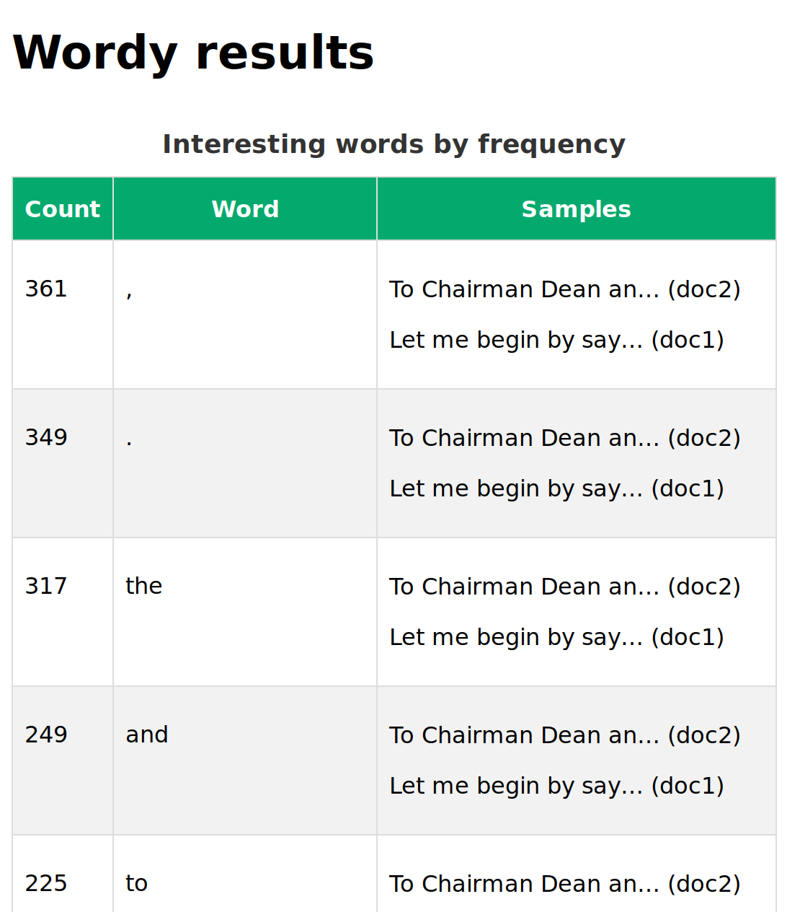

# Wordy document analyser

A simple example of natural language processing.

## Specification

### Primary user story

I am an end-user with many documents. I want to see  which
interesting words occur most frequently, so that I  can
identify important topics across all documents.

### Scenarios

**View results**

```gherkin
Given documents are parsed
When the user opens the page
Then display words sorted by frequency
And display a sample sentence from each document
```

**Upload a new file**

```gherkin
Given the filename has not been used before
When the user uploads the file
Then parse the contents
And display the updated results
```

**Upload an existing file**

```gherkin
Given the filename has been used before
When the user uploads the file
Then replace the old contents
And parse the new contents
And display the updated results
```

### Sample output

| Word       | Count | Samples                                             |
|------------|-------|-----------------------------------------------------|
| philosophy | 42    | I don't have time for philosophy... (document X)    |
|            |       | Surely this was a touch of... (document Y)          |
|            |       | Still, her pay-as-you-go philosophy... (document Z) |

### Notable features

* Simple command to download NLTK natural language data
* Stopwords (a, the, and...) are removed

### Limitations

**This site is not production-ready!**

* Minimal file validation
* Cannot specify download location for NLTK data
* Requires admin access to delete documents

### Out of scope

* Access rights and granular permissions
* Database instance (i.e. other than SQLite)
* Fully offline operation (no additional download steps required)
* Languages other than English (American spelling?)
* Microservice architecture
* REST API

## Screenshot



## Run from source

### Prerequisites

* Python 3.8
* [pipenv](https://pipenv.pypa.io/en/latest/install/)

### Steps

1. Create a virtual environment for Python:

   ```
   cd simplenlp
   pipenv install
   # tested on Ubuntu 20.04 LTS
   # if this fails, try deleting Pipfile.lock
   ```

2. Bootstrap Django:

   ```
   pipenv shell
   # activate virtual environment

   python manage.py initwordy
   # download natural language data (NLTK data)
   # this can take 1-2 minutes
   # default location is ~/nltk_data

   python manage.py migrate
   # create schema for SQLite database

   python manage.py createsuperuser
   # follow prompts to create an admin user
   
   python manage.py runserver
   # start Django site
   ```

3. Confirm there are no errors or warnings in the logs.

      * If you see a warning, you probably missed the
        `initwordy` step above.

4. Open http://localhost:8000 in your browser

      * The results table starts empty.

5. Choose and upload a text file to add it to the results.

      * You will get an error if you attempt to upload a non-text
        file. Go back and try again.

      * You will get an error if you missed the `initwordy` step
        while bootstrapping Django. Stop the site, run the `initwordy`
        command and try again.

6. Sample sentences are truncated. Hover over a sample to see the
   full sentence.

7. Keep uploading text files to recalculate the results. Duplicate
   filenames will overwrite existing documents and related results.

### Notes

* To inspect the database, visit the admin site
  http://localhost:8000/admin/ and log in with the superuser
  credentials created above.

* To remove a document from the results, you must delete it
  through the admin interface.
