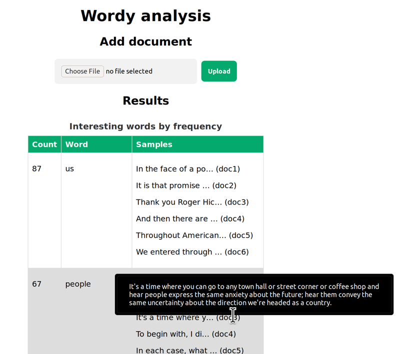

# Wordy document analyser

A simple example of natural language processing.

## Specification

### Primary user story

I am an end-user with many documents. I want to see  which
interesting words occur most frequently, so that I  can
identify important topics across all documents.

### Scenario

```gherkin
Given documents are parsed
When the user opens the page
Then display words sorted by frequency
And display a sample sentence from each document
```

### Notable features

* Stopwords are removed

### Sample output

| Word       | Count | Samples                                             |
|------------|-------|-----------------------------------------------------|
| philosophy | 42    | I don't have time for philosophy... (document X)    |
|            |       | Surely this was a touch of... (document Y)          |
|            |       | Still, her pay-as-you-go philosophy... (document Z) |

### Screenshot (work in progress)



### Out of scope

* Access rights and granular permissions
* Database instance (i.e. other than SQLite)
* File upload
* Fully offline operation
* Languages other than English (American spelling?)
* Microservice architecture
* REST API

## Run from source

### Prerequisites

* Python 3.8
* [pipenv](https://pipenv.pypa.io/en/latest/install/)

Set environment variable `MEDIA_ROOT` to the absolute
path of an empty folder, for example `/var/www/media`

### Steps

1. Create a virtual environment for Python:

   ```
   cd simplenlp
   pipenv install
   ```

2. Bootstrap Django:

   ```
   pipenv shell
   # activate virtual environment

   python manage.py migrate
   # create schema for SQLite database

   python manage.py createsuperuser
   # follow prompts to create an admin user
   
   python runserver
   # start Django site
   ```

3. Open http://localhost:8080/wordy/ in your browser to see results

4. Hover over a sample to see the full sentence containing the
   interesting word.

**Notes**

* To view database contents, visit the admin site
  http://localhost:8080/admin/ and log in with the superuser
  credentials created above.

* To upload documents, visit the admin site and create a
  document entry with the same name as a text file in the MEDIA
  folder. For example, `doc1` for `doc1.txt`
